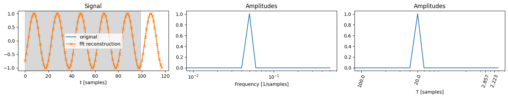

# Predicting sums of many periodic components

The goal of this small project was to see how easy or difficult it is to predict a signal made up of a significant amount of harmonics. I randomly generate a set of amplitudes, periods and phases, sum them together to obtain a synthetic signal. I then train a model to predict the composite signal. Obviously training a NN to predict one component is easy, but how about a signal with 40-ish components?

The task is less trivial than it might sound. While on first glance the Discrete Fourier Transform (DFT) might seem like the straightforward solution, it has a key problem. For it to perfectly reconstruct the signal also outside of the window on which you do the DFT (lookback window)  all the harmonics need to have a period that complete an integer number of cycles within it. If they are not, the DFT will give you amplitudes for a Fourier Series that perfectly matches the signal inside the lookback window, but might fail completely outside of it as the signal within the lookback window is just periodically repeated outside of it.

Note: 
- We'll use torch for our Neural Nets.
- We'll set the sample rate `fs=1`
- We'll deal with real signals only, so we stick to the Real DFT.

## DFT

First lets make sure to familiarize with the DFT so that we know how to use it properly. Training a [Neural Network learn to perform a DFT](https://gist.github.com/endolith/98863221204541bf017b6cae71cb0a89) is absolutely possible, but highly inefficient, so we'll provide the DFT as an input to our Network. 

### Theory recap

**1) FFT stands for Fast Fourier Transform and is the `O(nlog(n))` algorithm typically used to compute the DFT.**

Hence torch.fft numpy.fft, scipy.fft or torch.rfft for the Real DFT. 

**2) The DFT is a linear operation that maps a signal of N samples onto N (complex) values which represent the amplitudes and phases of the harmonics/components that make up the signal.**

The frequencies of these components are determined by `N` and the sample rate `fs`: `f[k]=k*fs/N`, or simply `f[k]=k/N` in our case.

**3) While there are N components in the DFT, these only correspond to about `N/2` different and unique fundamental frequencies.**

That is because the DFT maps the signal onto a given positive frequency and its negative separately. The two are functionally equivalent when dealing with real valued signals, so the two corresponding amplitudes are added together, and we just work with the positive frequency.

Specifically we have,

if N is even:
- `N/2`  positive frequency components, including the DC component (the constant value/offset of the signal). 
- `1` value for the Nyquist component `fs/2` (the highest possible frequency) 
- So `N/2+1` in total.

The frequencies will be `f = [0, 1/N, 2/N, ..., 1/2]`

The periods will be     `T = [0, N, N/2, ..., 2]`

if N is odd:
- `(N+1)/2`  positive frequency components including the DC component.
-  Note that we don't reach the Nyquist component in this case, the highest frequency component in the DFT will be slightly below it.

The frequencies will be `f = [0, 1/N, 2/N, ..., 1/2 - 1/2N]`

The periods will be     `T = [0, N, N/2, ..., 2N/(N-1)]`


Let's explore the above in torch and see if we get what we expect.


```python
import torch
# Even N
print("EVEN")
N = 16
expected_components = N/2 + 1
y = torch.arange(N)
dft = torch.fft.rfft(y)
assert int(expected_components) == len(dft)
print(len(dft), expected_components, dft.dtype)

f = torch.fft.rfftfreq(N)
T = 1/torch.fft.rfftfreq(N)
T[0]=0
print(f)
print(T)

# Odd N
print("ODD")
N=15
expected_components = (N+1)/2
y = torch.arange(N)
dft = torch.fft.rfft(y)
assert int(expected_components) == len(dft)
print(len(dft), expected_components, dft.dtype)

f = torch.fft.rfftfreq(N)
T = 1/torch.fft.rfftfreq(N)
T[0]=0
print(f)
print(T)

```

    EVEN
    9 9.0 torch.complex64
    tensor([0.0000, 0.0625, 0.1250, 0.1875, 0.2500, 0.3125, 0.3750, 0.4375, 0.5000])
    tensor([ 0.0000, 16.0000,  8.0000,  5.3333,  4.0000,  3.2000,  2.6667,  2.2857,
             2.0000])
    ODD
    8 8.0 torch.complex64
    tensor([0.0000, 0.0667, 0.1333, 0.2000, 0.2667, 0.3333, 0.4000, 0.4667])
    tensor([ 0.0000, 15.0000,  7.5000,  5.0000,  3.7500,  3.0000,  2.5000,  2.1429])


To get the corresponding amplitudes we do:


```python
amplitudes = torch.abs(dft) / N # Scale by N to retrieve the actual valued of the amplitudes of the harmonics
phases = torch.angle(dft)
print(len(amplitudes), amplitudes)
print(len(phases), phases)
```

    8 tensor([7.0000, 2.4049, 1.2293, 0.8507, 0.6728, 0.5774, 0.5257, 0.5028])
    8 tensor([0.0000, 1.7802, 1.9897, 2.1991, 2.4086, 2.6180, 2.8274, 3.0369])


### Exploration: DFT in pratice

Let's familiarize with how the DFT works in practice.

While obtaining values for the amplitudes, phases, frequencies etc...is interesting it does not help much with understanding.
What is more helpful is to understand the opposite direction of how the frequencies come together to build the signal and predict the signal beyond the sampling window.

So we will do `signal -> dft -> mess with the dft -> see how well the signal is reconstructed inside and outside the sampling window. `

Let's define some helper functions.


```python
import numpy as np
import matplotlib.pyplot as plt
import torch
from torch.utils.data import Dataset
import wandb
from pathlib import Path

np.random.seed(0)  # Seed for reproducibility

def generate_signal(num_samples=118, noise=False, num_components=(3, 7), periods_range=(2, 100)):
    """
    :param num_samples: Total number of samples in the signal
    :return: 
    """        
    if type(num_components) == int:
        num_components = (num_components, num_components+1)
    else:
        assert num_components[0] < num_components[1]
    if type(periods_range) == int:
        periods_range = (periods_range, periods_range+1)
    else:
        assert periods_range[0] <= periods_range[1]

    num_components = np.random.randint(*num_components)  # Randomly choose how many periods to combine
    
    periods = np.random.randint(*periods_range, num_components)  # Period lengths in samples
    phases = np.random.rand(num_components) * 2 * np.pi
    amplitudes = np.random.rand(num_components)
    amplitudes /= np.sum(amplitudes)

    # Sample indices
    samples = np.arange(num_samples)

    # Generate a random continuous periodic signal
    signal = sum(amplitude * np.sin(2 * np.pi * (1 / period) * samples + phase) for amplitude, period, phase in zip(amplitudes, periods, phases))
    signal = signal / np.max(np.abs(signal))  # Normalize signal

    # Add random noise to the signal
    if noise:
        noise = np.random.normal(0, 0.1, signal.shape)
        signal += noise
        signal = signal / np.max(np.abs(signal))  # Normalize signal again

    return torch.from_numpy(samples).to(torch.float), torch.from_numpy(signal).to(torch.float)


def get_fft_harmonics(orignal_signal, analysis_samples, hamming_smoothing=False):
    if hamming_smoothing:
        signal_window = orignal_signal[:analysis_samples]
        window = torch.hamming_window(analysis_samples, periodic=False)
        signal_window = signal_window * window
        fft_result = torch.fft.rfft(signal_window)
    else:
        fft_result = torch.fft.rfft(orignal_signal[:analysis_samples])
    amplitudes = torch.abs(fft_result) / analysis_samples
    phases = torch.angle(fft_result)
    
    # Double the amplitudes for non-DC components
    # Note: The last component should not be doubled if N is even and represents the Nyquist frequency
    if analysis_samples % 2 == 0:
        # If the original signal length is even, don't double the last component (Nyquist frequency)
        amplitudes[1: -1] *= 2
    else:
        # If the original signal length is odd, all components except the DC can be doubled
        amplitudes[1:] *= 2
    return amplitudes, phases

def get_signal_from_harmonics(amplitudes, phases, num_samples):
    analysis_samples = len(amplitudes) * 2 - 2  # Adjust for rfft output length
    reconstructed_signal = torch.zeros(num_samples, dtype=torch.complex64)
    for index, (amplitude, phase) in enumerate(zip(amplitudes, phases)):
        reconstructed_signal += amplitude * torch.exp(1j * (2 * torch.pi * index * torch.arange(num_samples) / analysis_samples + phase))

    # Return the real part of the reconstructed signal
    return reconstructed_signal.real


def reconstruct_signal_fft(orignal_signal, analysis_samples, hamming_smoothing=False):
    # Perform FFT on the entire signal
    amplitudes, phases = get_fft_harmonics(orignal_signal, analysis_samples, hamming_smoothing)

    # Return the real part of the reconstructed signal
    return get_signal_from_harmonics(amplitudes, phases, len(orignal_signal))

```

We can use `generate_signal` to produce a random signal or we can also use it to get a non-random output for just one compoent with a specified periodicity.


```python
plt.figure(figsize=(15, 2))

plt.subplot(2, 1, 1)
# signal with 1 component with a period of 10 samples
x,y  = generate_signal(num_components=1, periods_range=10)
plt.plot(x,y)
plt.subplot(2, 1, 2)
# signal with a random amount of components and periods
x,y  = generate_signal()
plt.plot(x,y)

plt.tight_layout()
plt.show()


```


    

    


Let's now define a function that takes care of plotting the original signal, the reconstructed signal and the amplitudes and phases of the harmonics.


```python

def plot_signal_and_fft(signal: torch.Tensor, train_test_split_idx: int, hamming_smoothing: bool = False):
    assert (W := signal.shape[0]) >= train_test_split_idx
    t_full = torch.arange(W)


    amplitudes, phases = get_fft_harmonics(signal, train_test_split_idx, hamming_smoothing)
    frequency_bins = np.arange(len(amplitudes), dtype=np.float16)

    plt.figure(figsize=(15, 3))

    plt.subplot(1, 3, 1)
    plt.plot(t_full, signal, label="original")
    plt.plot(t_full, get_signal_from_harmonics(amplitudes, phases, W), '-x', label="fft reconstruction")
    plt.axvspan(0, train_test_split_idx-1, color='grey', alpha=0.3)
    plt.xlabel('t [samples]')
    plt.legend(loc='best')
    plt.title('Signal')
    
    fft_frequencies = frequency_bins/train_test_split_idx
    plt.subplot(1, 3, 2)
    plt.xscale('log')
    plt.plot(fft_frequencies, amplitudes)
    plt.xlabel('Frequency [1/samples]')
    plt.title('Amplitudes')

    fft_periods = frequency_bins.copy()
    fft_periods[1:]=train_test_split_idx/fft_periods[1:]
    plt.subplot(1, 3, 3)
    plt.plot(frequency_bins, amplitudes)
    top_5_indices = np.argsort(amplitudes)[-4:]
    top_5_indices[0]=1
    plt.xscale('log')
    plt.xticks(frequency_bins[top_5_indices],fft_periods[top_5_indices], rotation=70)
    plt.xlabel('T [samples]')
    plt.title('Amplitudes')


    plt.tight_layout()
    plt.show()


```

Now let's start applying the DFT to 1 component and see how we do.
Let's generate 200 samples and do the DFT on the first 100.


```python
_, y = generate_signal(num_components=1, periods_range=20)
plot_signal_and_fft(y, 100)
```


    

    


Perfection! The DFT correctyl detects that we have 1 harmonic with a period of 20 samples, and our reconstruction then of course is also spot on outside of th fist 100 samples we did the DFT on.

We tried on 100 samples, then 110 samples must be even better! Let's try.


```python
_, y = generate_signal(num_components=1, periods_range=20)
plot_signal_and_fft(y, 110)
```


    

    


Ouch that is not what one could have hoped for. Why?

**Because the DFT "assumes" that all components have a periodicity that completes an integer number of cycles within the sampling window.**

But a sinusoid with a period of 20 does not complete an integer number of cycles in 120 samples. The consequence is that the power of the signal gets spread out a bit over more frequencies (amplitude peak is not perfectly narrow on 20). This is known as spectral leakage.

Moreover our "prediction" of the signal outside the sampling window becomes terrible, as the reconstructed signal is just a copy of  the signal inside the sampling window. This is exactly what the DFT assumes: that the sample window we provide is exactly the period of the signal (up to an integer factor)!

One way to reduce spectral leakage is having smoothing of the signal at the edges of the sampling window towards 0. 


```python
_, y = generate_signal(num_components=1, periods_range=20)
plot_signal_and_fft(y, 110, hamming_smoothing=True)
```


    

    


This localizes the amplitude peak a bit more, but it certianly doesn't help with the predicitve qualities of out reconstruction

Before we move on let's just look at the DFT of a more complex signal.


```python
_, y = generate_signal(200, noise=True)
plot_signal_and_fft(y, 110)
```


    

    


## LSTM

We have looked at how a DFT alone can help us in predicting our signals and the answer is, not very well.
So let's see how a very simple LSTM performs.

Let's define the Dataset class that will feed the data to our LSTM during traing and eval.


```python
import json
from typing import List
import random
import string
from datetime import datetime

class Logger:
    def __init__(self, run_name, send_to_wandb=False, id_resume=None, hyperparameters:List[str]=[]) -> None:
       
        common_kwargs={
            'project':"time-series",
            'tags': hyperparameters,
            'name': run_name,
        }
        if send_to_wandb and not id_resume:
            wandb.init(
                **common_kwargs
            )
            self.run_id = wandb.run.id
        if send_to_wandb and id_resume:
            wandb.init(
                **common_kwargs,
                id=id_resume,
                resume=True
            )
            self.run_id = id_resume
        
        if not send_to_wandb and id_resume:
            self.run_id = id_resume
        else:
            self.run_id = ''.join(random.choices(string.ascii_uppercase + string.digits, k=6))

        print("RUN ID", self.run_id)
        self.send_to_wandb = send_to_wandb
        
        base_dir = Path(f"./checkpoints/{self.run_id}/")
        base_dir.mkdir(parents=True, exist_ok=True)
        self.new_checkpoint_dir = Path(f"./checkpoints/{self.run_id}/{datetime.now().strftime('%d-%m-%Y_%H-%M-%S')}")
        self.new_checkpoint_dir.mkdir(parents=True, exist_ok=True)
        with open(f"{self.new_checkpoint_dir}/config.json", 'w') as f:
            json.dump({"run_name": run_name, "send_to_wandb": send_to_wandb, "id_resume": self.run_id, "hyperparameters": hyperparameters}, f)

    def log(self, data, step):
        if self.send_to_wandb:
            wandb.log(data, step)
    
    def finish(self):
        if self.send_to_wandb:
            wandb.finish()
    

            

def count_parameters(model):
    from prettytable import PrettyTable
    table = PrettyTable(["Modules", "Parameters"])
    total_params = 0
    for name, parameter in model.named_parameters():
        if not parameter.requires_grad:
            continue
        params = parameter.numel()
        table.add_row([name, params])
        total_params += params
    print(table)
    print(f"Total Trainable Params: {total_params}")
    return total_params
    

def train(
        model, 
        train_dataset, 
        eval_dataset, 
        optimizer, 
        loss_function, 
        logger, 
        epochs_from=0, 
        epochs_to=500, 
        device='cpu', 
        bs=32, 
        ):
    print("DEVICE", device)
    model.to(device)
    train_dataloader = torch.utils.data.DataLoader(train_dataset, batch_size=bs, shuffle=True)
    eval_dataloader = torch.utils.data.DataLoader(eval_dataset, batch_size=bs, shuffle=True)
    for i in range(epochs_from, epochs_to + 1):
        model.train()
        train_loss = 0
        for seq, labels in train_dataloader:
            optimizer.zero_grad()
            y_pred = model(seq.to(device))
            single_loss = loss_function(y_pred, labels.to(device))
            single_loss.backward()
            train_loss += single_loss
            optimizer.step()

        if i % 25 == 0:
            model.eval()
            val_loss = 0
            for seq, labels in eval_dataloader:
                y_pred = model(seq.to(device))
                single_loss = loss_function(y_pred, labels.to(device))
                val_loss += single_loss
            print(f'TRAIN: epoch: {i},  loss: {train_loss.item()}')
            print(f'VAL: epoch: {i},  val loss: {val_loss.item()} \n')
            logger.log({"train loss": train_loss.item(), "val loss": val_loss.item()}, i)
            if i % 100 == 0:
                torch.save(model.state_dict(), f"{logger.new_checkpoint_dir}/{i}_epochs")
        

```

### Small and simple LSTM


```python
class TimeSeriesDataset(Dataset):
    def __init__(self, size, num_samples):
        """
        :param size: Number of samples in the dataset
        """
        self.size = size
        self.num_samples = num_samples

    def __len__(self):
        return self.size

    def __getitem__(self, idx):
        _, signal = generate_signal(num_samples=self.num_samples)
        target = torch.roll(signal, -1, dims=0)
        return signal.unsqueeze_(dim=-1), target.unsqueeze_(dim=-1)
```

Now let's define the LSTM model itself.


```python
class LSTMPredictor(torch.nn.Module):
    def __init__(self, input_size=1, hidden_layer_size=100, output_size=1):
        super(LSTMPredictor, self).__init__()
        self.hidden_layer_size = hidden_layer_size

        self.lstm = torch.nn.LSTM(input_size, hidden_layer_size, batch_first=True, num_layers=1)
        self.linear = torch.nn.Linear(hidden_layer_size, output_size)

    def forward(self, input_seq):
        x, _ = self.lstm(input_seq)
        x = self.linear(x)
        return x

count_parameters(LSTMPredictor())
```

    +-------------------+------------+
    |      Modules      | Parameters |
    +-------------------+------------+
    | lstm.weight_ih_l0 |    400     |
    | lstm.weight_hh_l0 |   40000    |
    |  lstm.bias_ih_l0  |    400     |
    |  lstm.bias_hh_l0  |    400     |
    |   linear.weight   |    100     |
    |    linear.bias    |     1      |
    +-------------------+------------+
    Total Trainable Params: 41301


    41301


Let's inspect our model architetcure and initialize it.

Now we are ready to go, we just need to initialize the datasets, data loaders, optimizers and start our trainign loop.


```python
LR = 0.002
SIGNAL_SIZE=105
LOOKBACK_WINDOW_SIZE=100
EPOCH_FROM = 0
EPOCH_TO = 3000
SEND_TO_WANDB = True
#### BEGIN: Load model and init Logger
model = LSTMPredictor()

# checkpoint_path = './checkpoints/VVLZNW/1/500_epochs'
checkpoint_path = None

hyperparameters = [f"LR={LR}", f"PARAMS={count_parameters(model)}", f"SIGNAL_SIZE={SIGNAL_SIZE}", f"LOOKBACK_WINDOW_SIZE={LOOKBACK_WINDOW_SIZE}"]

if checkpoint_path:
    EPOCH_FROM = int(checkpoint_path.split("/")[-1].split("_")[0])
    run_id = checkpoint_path.split("/")[-3]
    model.load_state_dict(torch.load(checkpoint_path))
    logger = Logger("small-lstm", send_to_wandb=SEND_TO_WANDB, id_resume=run_id, hyperparameters=hyperparameters)
else:
    logger = Logger("small-lstm", send_to_wandb=SEND_TO_WANDB, hyperparameters=hyperparameters)
### END
    
loss_function = torch.nn.MSELoss()
optimizer = torch.optim.Adam(model.parameters(), lr=LR)
train_dataset = TimeSeriesDataset(size=1000, num_samples=SIGNAL_SIZE) 
eval_dataset = TimeSeriesDataset(size=1000, num_samples=SIGNAL_SIZE)  

assert EPOCH_TO > EPOCH_FROM
print(f"Training from {EPOCH_FROM} to {EPOCH_TO}")

train(
    model=model,
    train_dataset=train_dataset,
    eval_dataset=eval_dataset,
    optimizer=optimizer,
    epochs_from=EPOCH_FROM,
    epochs_to=EPOCH_TO,
    loss_function=loss_function,
    logger=logger
    )


```

    +-------------------+------------+
    |      Modules      | Parameters |
    +-------------------+------------+
    | lstm.weight_ih_l0 |    400     |
    | lstm.weight_hh_l0 |   40000    |
    |  lstm.bias_ih_l0  |    400     |
    |  lstm.bias_hh_l0  |    400     |
    |   linear.weight   |    100     |
    |    linear.bias    |     1      |
    +-------------------+------------+
    Total Trainable Params: 41301


    Failed to detect the name of this notebook, you can set it manually with the WANDB_NOTEBOOK_NAME environment variable to enable code saving.


Tracking run with wandb version 0.16.5


Syncing run <strong><a href='https://wandb.ai/shape-vs-texture/time-series/runs/tju1rve5/workspace' target="_blank">small-lstm</a></strong> to <a href='https://wandb.ai/shape-vs-texture/time-series' target="_blank">Weights & Biases</a> (<a href='https://wandb.me/run' target="_blank">docs</a>)<br/>


View project at <a href='https://wandb.ai/shape-vs-texture/time-series' target="_blank">https://wandb.ai/shape-vs-texture/time-series</a>


View run at <a href='https://wandb.ai/shape-vs-texture/time-series/runs/tju1rve5/workspace' target="_blank">https://wandb.ai/shape-vs-texture/time-series/runs/tju1rve5/workspace</a>


    RUN ID 5W53HL
    Training from 0 to 3000
    DEVICE cpu
    TRAIN: epoch: 0,  loss: 4.253148555755615
    VAL: epoch: 0,  val loss: 2.199153184890747 
    
    TRAIN: epoch: 25,  loss: 1.390575885772705
    VAL: epoch: 25,  val loss: 1.3621937036514282 
    
    TRAIN: epoch: 50,  loss: 0.9991466999053955
    VAL: epoch: 50,  val loss: 0.9919925928115845 
    
    TRAIN: epoch: 75,  loss: 0.48536786437034607
    VAL: epoch: 75,  val loss: 0.48534858226776123

    ...

    TRAIN: epoch: 2975,  loss: 0.1880655735731125
    VAL: epoch: 2975,  val loss: 0.19832146167755127 
    
    TRAIN: epoch: 3000,  loss: 0.17675428092479706
    VAL: epoch: 3000,  val loss: 0.164883092045784 


```python
logger.finish()
```


<style>
    table.wandb td:nth-child(1) { padding: 0 10px; text-align: left ; width: auto;} td:nth-child(2) {text-align: left ; width: 100%}
    .wandb-row { display: flex; flex-direction: row; flex-wrap: wrap; justify-content: flex-start; width: 100% }
    .wandb-col { display: flex; flex-direction: column; flex-basis: 100%; flex: 1; padding: 10px; }
    </style>
<div class="wandb-row"><div class="wandb-col"><h3>Run history:</h3><br/><table class="wandb"><tr><td>train loss</td><td>█▂▁▁▁▁▁▁▁▁▁▁▁▁▁▁▁▁▁▁▁▁▁▁▁▁▁▁▁▁▁▁▁▁▁▁▁▁▁▁</td></tr><tr><td>val loss</td><td>█▂▂▁▁▁▁▁▁▁▁▁▁▁▁▁▁▁▁▁▁▁▁▁▁▁▁▁▁▁▁▁▁▁▁▁▁▁▁▁</td></tr></table><br/></div><div class="wandb-col"><h3>Run summary:</h3><br/><table class="wandb"><tr><td>train loss</td><td>0.17675</td></tr><tr><td>val loss</td><td>0.16488</td></tr></table><br/></div></div>


View run <strong style="color:#cdcd00">small-lstm</strong> at: <a href='https://wandb.ai/shape-vs-texture/time-series/runs/tju1rve5/workspace' target="_blank">https://wandb.ai/shape-vs-texture/time-series/runs/tju1rve5/workspace</a><br/>Synced 6 W&B file(s), 0 media file(s), 0 artifact file(s) and 0 other file(s)


Find logs at: <code>./wandb/run-20240402_102819-tju1rve5/logs</code>


```python
# model.load_state_dict(torch.load("checkpoints/0a4eos6o/500_epochs_0a4eos6o"))
```

Let's see how our model performs.

First of all we need to remember that if we feed a sequence to an LSTM model, then the prediction at point `n+1` will be based on all points before that. So when plotting the prediction the LSTM can't really mess up that much since at each step we predict on all the previous actual ground truth values.

No surprise then that the plot looks pretty good.


```python
t, signal = generate_signal(num_samples=SIGNAL_SIZE)
pred = model(signal.view(1, len(signal), 1))
predicted_signal = pred.view(len(signal)).detach()
predicted_signal = torch.roll(predicted_signal, 1, dims=0)

# Plotting
plt.figure(figsize=(15, 3))

plt.plot(t, signal, label='input')
plt.plot(t, predicted_signal, label='lstm predicted')
plt.legend(loc='best')
plt.xlabel('Time [sec]')
plt.ylabel('Amplitude')


plt.tight_layout()
plt.show()
```


    

    


The real test is autoregressive generation, where we give the LSTM a part of the ground truth, and then use the LSTMs own output for step `n` to also predict `n+1` etc.

Let's see how we do in that case.


```python
def lstm_autoregressive_pred(signal, N):
    signal_continuation_autoreg = torch.clone(signal)
    signal_continuation_autoreg[N:] = 0
    for i in range(len(signal[N:])):
        pred = model(signal_continuation_autoreg.view(1, len(signal_continuation_autoreg), 1))
        pred = pred.view(len(signal_continuation_autoreg)).detach()
        signal_continuation_autoreg[N+i] = pred[N+i-1]
    return signal_continuation_autoreg

N=LOOKBACK_WINDOW_SIZE
for _ in range(10):
    t, signal = generate_signal(num_samples=SIGNAL_SIZE)
    plt.figure(figsize=(15, 3))

    plt.plot(t, signal, label='input')
    plt.plot(t, reconstruct_signal_fft(signal, N),'-x', label='fft reconstruction')
    plt.plot(t, lstm_autoregressive_pred(signal,N),'-x', label='lstm predicted')
    plt.legend(loc='best')
    plt.xlabel('Time [sec]')
    plt.ylabel('Amplitude')

    plt.axvspan(0, N-1, color='grey', alpha=0.3)


plt.tight_layout()
plt.show()
```


    

    


    

    


    

    


    

    


    

    


    

    


    

    


    

    


    

    


    

    


As one can see this is not exactly doing a good job.

### Sequence to Sequence

Perhaps the problem is that we are trying to use the model autoregressively to predict a longer sequence, even though it was trained to only ever make a prediction for the next elemen, so errors accumulate too much.

Let's try a different model architecture, one where we actually train it to produce a longer sequence directly.
Do to dis we'll use an LSTM to encode the lookback window into a hidden state and we'll use another LSTM to decode that into the predicted sequence.


```python
class SeqToSeqDataset(Dataset):
    def __init__(self, size, num_samples=150, split_idx=100, lookback_window_size=100, return_decoder_input=True):
        assert num_samples > split_idx
        self.size = size
        self.num_samples = num_samples
        self.split_idx = split_idx
        self.lookback_window_size = lookback_window_size
        self.return_decoder_input = return_decoder_input

    def __len__(self):
        return self.size

    def __getitem__(self, idx):
        _, signal = generate_signal(num_samples=self.num_samples, periods_range=(2, self.lookback_window_size))
        encoder_input = signal[:self.split_idx]
        decoder_input = signal[self.split_idx-1:]
        decoder_targets = torch.roll(decoder_input, -1, dims=0)
        if self.return_decoder_input:
            return torch.concat((encoder_input, decoder_input[:-1]), dim=0).unsqueeze_(dim=-1), decoder_targets[:-1].unsqueeze_(dim=-1)
        else:
            return encoder_input.unsqueeze_(dim=-1), decoder_targets[:-1].unsqueeze_(dim=-1)
```

Let's switch from LSTMs to GRUs as they are more parameter efficient.


```python
class GruEncoder(torch.nn.Module):
    def __init__(self, hidden_size) -> None:
        super(GruEncoder, self).__init__()
        self.gru = torch.nn.GRU(input_size=1, hidden_size=hidden_size, batch_first=True, num_layers=1)
        
    def forward(self, encoder_input):
        _, h_n = self.gru(encoder_input) # h_n =[1, N, h_dim]
        fft_result = torch.fft.rfft(encoder_input, dim=1, norm="forward")
        amplitudes = torch.abs(fft_result) # = [N, f_dim, 1]
        phases =  torch.angle(fft_result)
        return torch.concat((h_n, amplitudes.view(1,encoder_input.shape[0],-1), phases.view(1,encoder_input.shape[0],-1)), dim=-1).squeeze_(dim=0)
    
class GruDecoderCell(torch.nn.Module):
    def __init__(self, hidden_size) -> None:
        super(GruDecoderCell, self).__init__()
        self.gru_cell = torch.nn.GRUCell(input_size=1, hidden_size=hidden_size)
    
    def forward(self, input, h):    
        return self.gru_cell(input, h)
    

class SeqToSeqGru(torch.nn.Module):
    def __init__(self, encoder_input_length=100, decoder_input_length=50) -> None:
        super(SeqToSeqGru, self).__init__()
        self.encoder_in_dim = encoder_input_length
        self.decoder_in_dim = decoder_input_length
        
        self.encoder_hidden_dim = 10
        self.encoder_output_dim = self.encoder_hidden_dim + 2*(int(self.encoder_in_dim/2) + 1) # hidden dim + cat 2 * rfft

        self.encoder = GruEncoder(hidden_size=self.encoder_hidden_dim)
        self.decoder_cell = GruDecoderCell(hidden_size=self.encoder_output_dim)
        self.leaky_relu = torch.nn.LeakyReLU()
        self.linear_1 = torch.nn.Linear(self.encoder_output_dim, int(self.encoder_output_dim/2))
        self.linear_2 = torch.nn.Linear(int(self.encoder_output_dim/2), 1) 
        
    def forward(self, input): 
        if input.shape[1] == self.encoder_in_dim:
            encoder_input = input
            decoder_input = None
        elif input.shape[1] == self.encoder_in_dim + self.decoder_in_dim:
            encoder_input, decoder_input = input[:,:self.encoder_in_dim,:], input[:,self.encoder_in_dim:,:]
        else:
            raise "input shape mismatch"
        # assert encoder_input.shape[1] == self.encoder_in_dim
        # assert decoder_input.shape[1] == self.decoder_in_dim

        # Compress all of lookback window into hidden state with encoder and concat with fft
        h_n_augemented = self.encoder(encoder_input) # [N, h_encoder + fft]
        
        # init hidden state for decoder is the compressed lookback window hidden state from the encoder   
        h_decoder = h_n_augemented
        decoder_outputs = torch.empty((encoder_input.shape[0], self.decoder_in_dim, h_n_augemented.shape[-1]), dtype=torch.float) # [N, dec_in, h_enc+fft] 
        mlp_outputs = torch.empty((encoder_input.shape[0], self.decoder_in_dim, 1), dtype=torch.float) # [N, dec_in, 1] 
        # teacher forcing: feed actual sequence to decoder
        if decoder_input is not None: # Loop over inputs and feed them to decoder cell while updating the hidden state
            for i in range(self.decoder_in_dim):
                input_element = decoder_input[:,i,:]
                h_decoder = self.decoder_cell(input_element, h_decoder) # [N, h_enc + fft]
                decoder_outputs[:, i, :] = h_decoder
            x = self.linear_1(decoder_outputs)
            x = self.leaky_relu(x)
            x = self.linear_2(x)
            return x
        else: # No teacher forcing: autoregress
            # init the autoregression with the last value in the lookback window
            decoder_input = encoder_input[:,-1,:] #
            for i in range(self.decoder_in_dim):
                h_decoder = self.decoder_cell(decoder_input, h_decoder)
                # decoder_outputs[:, i, :] = h_decoder
                x = self.linear_1(h_decoder)
                x = self.leaky_relu(x)
                x = self.linear_2(x)
                decoder_input = x.clone().detach()
                mlp_outputs[:, i, :] = x
            return mlp_outputs
        
count_parameters(SeqToSeqGru(encoder_input_length=100, decoder_input_length=50))

```

    +---------------------------------+------------+
    |             Modules             | Parameters |
    +---------------------------------+------------+
    |     encoder.gru.weight_ih_l0    |     30     |
    |     encoder.gru.weight_hh_l0    |    300     |
    |      encoder.gru.bias_ih_l0     |     30     |
    |      encoder.gru.bias_hh_l0     |     30     |
    | decoder_cell.gru_cell.weight_ih |    336     |
    | decoder_cell.gru_cell.weight_hh |   37632    |
    |  decoder_cell.gru_cell.bias_ih  |    336     |
    |  decoder_cell.gru_cell.bias_hh  |    336     |
    |         linear_1.weight         |    6272    |
    |          linear_1.bias          |     56     |
    |         linear_2.weight         |     56     |
    |          linear_2.bias          |     1      |
    +---------------------------------+------------+
    Total Trainable Params: 45415


    45415


```python
LR = 0.002
SIGNAL_SIZE=105
LOOKBACK_WINDOW_SIZE=100
PREDICTION_SIZE=5
assert LOOKBACK_WINDOW_SIZE + PREDICTION_SIZE == SIGNAL_SIZE
EPOCH_FROM = 0
EPOCH_TO = 3000
SEND_TO_WANDB = True

#### BEGIN: Load model and init Logger
model = SeqToSeqGru(encoder_input_length=LOOKBACK_WINDOW_SIZE, decoder_input_length=PREDICTION_SIZE)

# checkpoint_path = './checkpoints/VVLZNW/1/500_epochs'
checkpoint_path = None

hyperparameters = [f"LR={LR}", f"PARAMS={count_parameters(model)}", f"SIGNAL_SIZE={SIGNAL_SIZE}", f"LOOKBACK_WINDOW_SIZE={LOOKBACK_WINDOW_SIZE}", f"PREDICTION_SIZE={PREDICTION_SIZE}"]

if checkpoint_path:
    EPOCH_FROM = int(checkpoint_path.split("/")[-1].split("_")[0])
    run_id = checkpoint_path.split("/")[-3]
    model.load_state_dict(torch.load(checkpoint_path))
    logger = Logger("enocder-decoder-lstm", send_to_wandb=SEND_TO_WANDB, id_resume=run_id, hyperparameters=hyperparameters)
else:
    logger = Logger("enocder-decoder-lstm", send_to_wandb=SEND_TO_WANDB, hyperparameters=hyperparameters)
### END
    
loss_function = torch.nn.MSELoss()
optimizer = torch.optim.Adam(model.parameters(), lr=LR)
train_dataset = SeqToSeqDataset(size=1000, num_samples=SIGNAL_SIZE, split_idx=LOOKBACK_WINDOW_SIZE, return_decoder_input=True) 
eval_dataset = SeqToSeqDataset(size=1000, num_samples=SIGNAL_SIZE, split_idx=LOOKBACK_WINDOW_SIZE, return_decoder_input=False)  

assert EPOCH_TO > EPOCH_FROM
print(f"Training from {EPOCH_FROM} to {EPOCH_TO}")

train(
    model=model,
    train_dataset=train_dataset,
    eval_dataset=eval_dataset,
    optimizer=optimizer,
    epochs_from=EPOCH_FROM,
    epochs_to=EPOCH_TO,
    loss_function=loss_function,
    logger=logger
    )


```

    +---------------------------------+------------+
    |             Modules             | Parameters |
    +---------------------------------+------------+
    |     encoder.gru.weight_ih_l0    |     30     |
    |     encoder.gru.weight_hh_l0    |    300     |
    |      encoder.gru.bias_ih_l0     |     30     |
    |      encoder.gru.bias_hh_l0     |     30     |
    | decoder_cell.gru_cell.weight_ih |    336     |
    | decoder_cell.gru_cell.weight_hh |   37632    |
    |  decoder_cell.gru_cell.bias_ih  |    336     |
    |  decoder_cell.gru_cell.bias_hh  |    336     |
    |         linear_1.weight         |    6272    |
    |          linear_1.bias          |     56     |
    |         linear_2.weight         |     56     |
    |          linear_2.bias          |     1      |
    +---------------------------------+------------+
    Total Trainable Params: 45415


Tracking run with wandb version 0.16.5


Syncing run <strong><a href='https://wandb.ai/shape-vs-texture/time-series/runs/68ld8685/workspace' target="_blank">encoder-decoder-lstm</a></strong> to <a href='https://wandb.ai/shape-vs-texture/time-series' target="_blank">Weights & Biases</a> (<a href='https://wandb.me/run' target="_blank">docs</a>)<br/>


View project at <a href='https://wandb.ai/shape-vs-texture/time-series' target="_blank">https://wandb.ai/shape-vs-texture/time-series</a>


View run at <a href='https://wandb.ai/shape-vs-texture/time-series/runs/68ld8685/workspace' target="_blank">https://wandb.ai/shape-vs-texture/time-series/runs/68ld8685/workspace</a>


    RUN ID CKOBK3
    Training from 0 to 3000
    DEVICE cpu
    TRAIN: epoch: 0,  loss: 4.388464450836182
    VAL: epoch: 0,  val loss: 4.319097518920898 
    
    TRAIN: epoch: 25,  loss: 0.5327506065368652
    VAL: epoch: 25,  val loss: 2.443162679672241 
    
    TRAIN: epoch: 50,  loss: 0.2513550817966461
    VAL: epoch: 50,  val loss: 2.1959521770477295 
    
    TRAIN: epoch: 75,  loss: 0.13654153048992157
    VAL: epoch: 75,  val loss: 2.72782039642334 
    
    TRAIN: epoch: 100,  loss: 0.09969203174114227
    VAL: epoch: 100,  val loss: 1.4660788774490356 

    ...

    TRAIN: epoch: 2975,  loss: 0.013129068538546562
    VAL: epoch: 2975,  val loss: 0.8681044578552246 
    
    TRAIN: epoch: 3000,  loss: 0.01448422484099865
    VAL: epoch: 3000,  val loss: 0.5304955840110779 


```python
logger.finish()
```


<style>
    table.wandb td:nth-child(1) { padding: 0 10px; text-align: left ; width: auto;} td:nth-child(2) {text-align: left ; width: 100%}
    .wandb-row { display: flex; flex-direction: row; flex-wrap: wrap; justify-content: flex-start; width: 100% }
    .wandb-col { display: flex; flex-direction: column; flex-basis: 100%; flex: 1; padding: 10px; }
    </style>
<div class="wandb-row"><div class="wandb-col"><h3>Run history:</h3><br/><table class="wandb"><tr><td>train loss</td><td>█▁▁▁▁▁▁▁▁▁▁▁▁▁▁▁▁▁▁▁▁▁▁▁▁▁▁▁▁▁▁▁▁▁▁▁▁▁▁▁</td></tr><tr><td>val loss</td><td>█▅▃▃▂▂▂▂▂▂▁▂▁▂▂▁▂▂▃▁▂▂▁▁▂▁▂▁▁▂▂▂▂▁▁▁▂▂▁▁</td></tr></table><br/></div><div class="wandb-col"><h3>Run summary:</h3><br/><table class="wandb"><tr><td>train loss</td><td>0.01448</td></tr><tr><td>val loss</td><td>0.5305</td></tr></table><br/></div></div>


View run <strong style="color:#cdcd00">enocder-decoder-lstm</strong> at: <a href='https://wandb.ai/shape-vs-texture/time-series/runs/68ld8685/workspace' target="_blank">https://wandb.ai/shape-vs-texture/time-series/runs/68ld8685/workspace</a><br/>Synced 6 W&B file(s), 0 media file(s), 0 artifact file(s) and 0 other file(s)


Find logs at: <code>./wandb/run-20240402_110920-68ld8685/logs</code>


```python
def lstm_pred(signal, N):
    signal = torch.clone(signal)
    pred = model(signal[:N].view(1,N,1))
    return pred.view(SIGNAL_SIZE-N).detach()

for _ in range(10):
    t, signal = generate_signal(num_samples=SIGNAL_SIZE, periods_range=(2,100))
    plt.figure(figsize=(15, 3))

    plt.plot(t, signal, label='input')
    plt.plot(t, reconstruct_signal_fft(signal, LOOKBACK_WINDOW_SIZE),'-x', label='fft reconstruction')
    plt.plot(range(LOOKBACK_WINDOW_SIZE, SIGNAL_SIZE), lstm_pred(signal, LOOKBACK_WINDOW_SIZE),'-x', label='lstm predicted')
    plt.legend(loc='best')
    plt.xlabel('Time [sec]')
    plt.ylabel('Amplitude')

    plt.axvspan(0, LOOKBACK_WINDOW_SIZE-1, color='grey', alpha=0.3)


plt.tight_layout()
plt.show()
```


    

    


    

    


    

    


    

    


    

    


    

    


    

    


    

    


    

    


    

    


As we can see this already looks much better.

## Training a larger model on more complex signals

Above we have trained  small models of about 40k parameters for a very short time.
For my final experiment we:
- use GRUs rather than LSTMs as they are more parameter efficient
- do away with the GRU encoder and rather embed the lookback window + fft with a faster MLP
- do away with teacher forcing in the decoder during training
- train our model progressively until we have model that can handle up to 45 different components
- train on about 30 million synthetic samples with a lookback of 100 samples and predicting the next 10 samples

For this las experiment see `train.py`.

### Results

Preliminary results are satisfactory in that the model starts to predict the signal fairly accurately even for signals with up to 45 harmonic components. I did not train to full convergence, there was still room to improve the performance quite a bit I believe judging from the training behaviour and the validation curves, and the examples below show that the model either already nails the prediction perfectly or it clearly has the right intuition about where the signal will go but can't quite nail the values perfectly yet.

(*in legend lstm should actually be gru)


